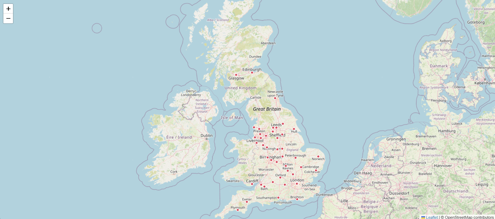
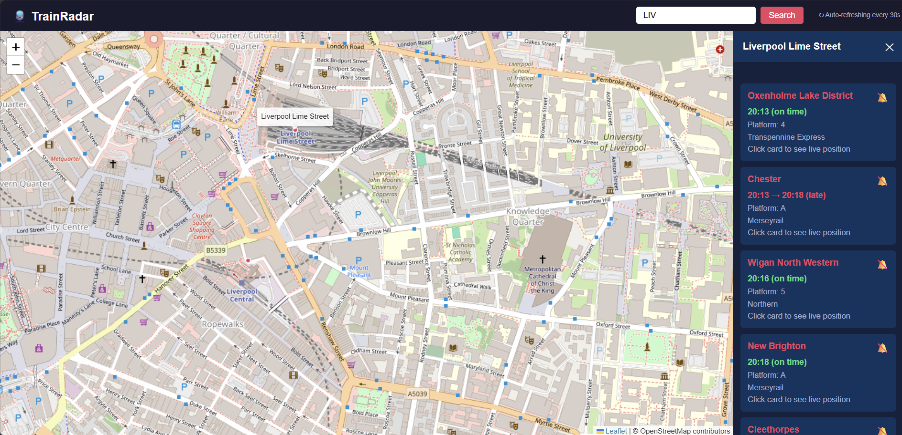
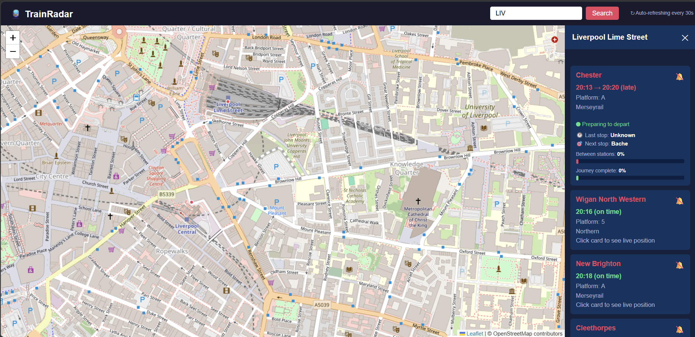
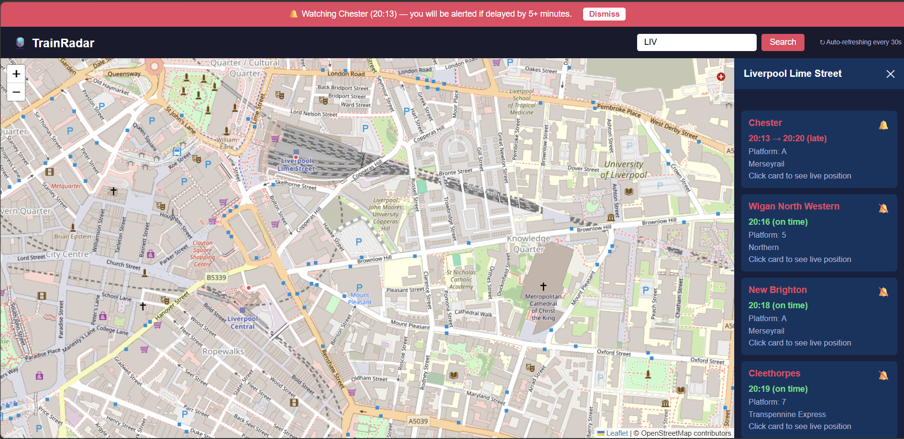

# TrainRadar 🚆

A live UK train tracking web application that displays real-time train positions on an interactive map. Users can search for any UK station, view live departures, track estimated train positions between stations, and set delay alerts for specific services.

Built as part of my MSc dissertation at the University of Liverpool (COMP702, 2025/26).

---

## Live Features

- 🗺️ **Interactive UK map** with clickable station markers across the country
- 🚆 **Live departure boards** — real-time train data from the Real Time Trains API
- 📍 **Train position estimator** — calculates where a train currently is between two stations using time-based linear interpolation
- ⏱️ **Journey progress** — shows last station departure time, next station predicted arrival, and two progress bars (current leg and full route)
- 🟢🔴 **On time / late indicators** — colour coded departure times with delay amounts
- 🔔 **Delay alerts** — watch specific trains and receive on-screen notifications if they run 5+ minutes late
- ↻ **Auto-refresh** — train data updates automatically every 30 seconds

---

## Screenshots

### Main Map View
> Interactive UK map with station markers. Click any red marker to load live departures.



### Live Departure Board
> Side panel showing real-time departures from Liverpool Lime Street with on time and late indicators.



### Train Position Calculator
> Click any train card to see estimated live position, last station, next station, and journey progress bars.



### Delay Alert
> Set a delay alert on any train. An alert banner appears if the train runs 5+ minutes late.



---

## How It Works

### Train Position Calculator
Train APIs only confirm a train's position when it arrives at or departs from a station — they do not provide live GPS coordinates. TrainRadar estimates the position between stations using **linear interpolation**:

```
Elapsed time since last departure
─────────────────────────────────  =  % of leg complete
Total scheduled time between stops
```

This percentage is then applied to the geographic coordinates of the two surrounding stations to place the marker on the map. The same principle is used in real-time transit systems worldwide.

### Architecture
```
Browser (Leaflet.js map + JavaScript)
           ↕ fetch()
Flask backend (Python)
           ↕ requests
Real Time Trains API  +  OpenStreetMap tiles
```

---

## Tech Stack

| Layer | Technology |
|---|---|
| Backend | Python 3, Flask |
| Frontend | HTML5, CSS3, JavaScript |
| Map | Leaflet.js, OpenStreetMap |
| Train data | Real Time Trains API (RTT) |
| Deployment | PythonAnywhere |

---

## Project Structure

```
TrainRadar/
│
├── app.py              ← Flask application and API routes
├── train_api.py        ← RTT API integration and token handling
├── stations.py         ← UK station coordinates dataset (50 major stations)
├── .env                ← API credentials (not committed to GitHub)
├── .gitignore
│
├── templates/
│   └── index.html      ← Main map page with all frontend logic
│
├── static/             ← CSS and static assets
│
└── docs/
    └── screenshots/    ← README screenshots
```

---

## Getting Started

### Prerequisites
- Python 3.8+
- A free API account at [api-portal.rtt.io](https://api-portal.rtt.io)

### Installation

1. Clone the repository:
```bash
git clone https://github.com/Satyambhardwaj19/TrainRadar.git
cd TrainRadar
```

2. Install dependencies:
```bash
pip install flask requests python-dotenv
```

3. Create a `.env` file in the root folder:
```
RTT_TOKEN=your_refresh_token_here
```

4. Run the app:
```bash
python app.py
```

5. Open your browser and go to:
```
http://localhost:5000
```

---

## API Reference

The Flask backend exposes these endpoints:

| Endpoint | Method | Description |
|---|---|---|
| `/` | GET | Main map page |
| `/api/stations` | GET | Returns all station coordinates as JSON |
| `/api/trains/<code>` | GET | Returns live departures for a station e.g. `/api/trains/LIV` |
| `/api/service/<id>/<date>` | GET | Returns position data for a specific train service |

### Station Codes
Use standard UK CRS codes — e.g. `LIV` (Liverpool Lime Street), `MAN` (Manchester Piccadilly), `EUS` (London Euston), `KGX` (Kings Cross).

---

## Data Attribution

- Train data: [Real Time Trains API](https://www.realtimetrains.co.uk) — non-commercial use
- Map tiles: [OpenStreetMap](https://www.openstreetmap.org) contributors © OpenStreetMap
- Station coordinates: compiled from public National Rail data

---

## Academic Context

This project was built as the practical component of my MSc Computer Science dissertation at the University of Liverpool (COMP702, 2025/26), supervised by Dr. David Purser.

The train position calculator is the core computer science contribution — addressing the challenge that train APIs do not expose live GPS positions, requiring algorithmic estimation of location between known waypoints.

---

## Future Improvements

- Deploy publicly on PythonAnywhere so anyone can access it
- Expand station database beyond current 50 major stations
- Add map markers that move in real time as trains progress
- Add historical delay statistics per route
- Add a journey planner — enter origin and destination, see all available trains

---

## Author

**Satyam Bhardwaj**
MSc Computer Science, University of Liverpool
[GitHub](https://github.com/Satyambhardwaj19)
